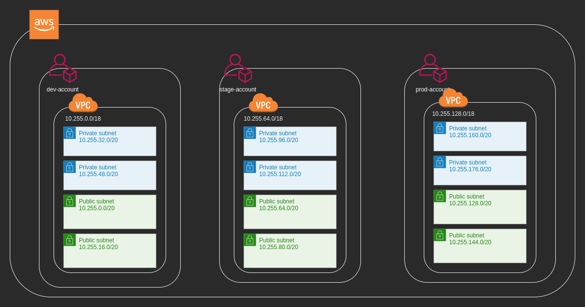

# terraform-vpc-bootstrap
This bootstrap  will show us for a Multi Enviroment(Dev,Stage,Prod) project How to create Default  VPC, Subnets(Pivates and Public), NatGateway and VPN Gateway configuration  in AWS.

## Blueprint

## Pre-requisites
* [tfenv](https://github.com/tfutils/tfenv) utility
* Terraform version 0.15.1
The  `.terraform-version` and `version.tf` files  works with tfenv utility. It will install if needed and switch to the Terrraform version specified by `.terraform-version` and `version.tf` will validate that the correct version is in use.
* version.tf
    ```
    terraform {
      required_version = ">= 0.15"
    }
    ```
* .terraform-version
    ```
    terraform {
      required_version = ">= 0.15"
    }
    ```
* Deployment user with programatic access created at the Root account with `AWSAdministratorAccess`.
* AssumeRole policy created at Root account and assigned to the Deployment User.
    ```
    Assume Role Policy applied on Deployment User
    {
        "Version": "2012-10-17",
        "Statement": {
            "Effect": "Allow",
            "Action": "sts:AssumeRole",
            "Resource": "*"
        }
    }
    ```
* Deployment Role `arn:aws:iam::${MASTER_ACCOUNT_ID}:role/project-deploy-role` with `AdministratorAccess` and a Trust Relationship with the Deployment User created at Root account, This  Deployment role to be created  Per Enviroment(Dev,Stage,Prod), Deployment Role Will be use by terraform_exec.sh Script.
    ```
    Trust Relationship
    {
      "Version": "2012-10-17",
      "Statement": [
        {
          "Effect": "Allow",
          "Principal": {
            "AWS": "arn:aws:iam::XXXXXXXXX:user/deployment-user"
          },
          "Action": "sts:AssumeRole",
          "Condition": {}
        }
      ]
    }
    ```

##NOTE

  **The Assume role and Deployment role are needed just for a multiaccount setup.**


## Environment Variables

Environment variables needed to execute this deployment.

| Name | Value | Description |
|------|---------|--------|
|AWS_ACCESS_KEY_ID| n/a | n/a |
|AWS_SECRET_ACCESS_KEY| n/a | n/a |
|AWS_REGION | ca-central-1| n/a |
|ENV | \<env\>| n/a |

## Backend Requirements
* Create Backend Bucket
* [Create Backend Dynamo Table](https://www.terraform.io/docs/language/settings/backends/s3.html#dynamodb-state-locking)


| Name | Version |
|------|---------|
| Bucket name | project-eks-terraform-state-\<ENV\>|
| Table name | \<ENV\>-project-eks-terraform-state-lock-dynamo |
| Key | LockID \(string\) |


## Providers

| Name | Version |
|------|---------|
| <a name="provider_aws"></a> [aws](#provider\_aws) | n/a |

## Modules

| Name | Source | Version |
|------|--------|---------|
| <a name="module_vpc"></a> [vpc](#module\_vpc) | terraform-aws-modules/vpc/aws | n/a |

## Resources

| Name | Type |
|------|------|
| [aws_eip.nat](https://registry.terraform.io/providers/hashicorp/aws/latest/docs/resources/eip) | resource |
| [aws_availability_zones.available](https://registry.terraform.io/providers/hashicorp/aws/latest/docs/data-sources/availability_zones) | data source |
| [aws_caller_identity.current](https://registry.terraform.io/providers/hashicorp/aws/latest/docs/data-sources/caller_identity) | data source |

## Inputs

| Name | Description | Type | Default | Required |
|------|-------------|------|---------|:--------:|
| <a name="input_count_eip_nat"></a> [count\_eip\_nat](#input\_count\_eip\_nat) | n/a | `number` | `1` | no |
| <a name="input_create_vpc"></a> [create\_vpc](#input\_create\_vpc) | n/a | `bool` | `true` | no |
| <a name="input_enable_natgateway"></a> [enable\_natgateway](#input\_enable\_natgateway) | n/a | `bool` | `true` | no |
| <a name="input_enable_vpngateway"></a> [enable\_vpngateway](#input\_enable\_vpngateway) | n/a | `bool` | `false` | no |
| <a name="input_env"></a> [env](#input\_env) | n/a | `string` | `"dev"` | no |
| <a name="input_external_nat_ip_ids"></a> [external\_nat\_ip\_ids](#input\_external\_nat\_ip\_ids) | n/a | `list` | <pre>[<br>  ""<br>]</pre> | no |
| <a name="input_owner_tag"></a> [owner\_tag](#input\_owner\_tag) | n/a | `string` | `"DevOps Team"` | no |
| <a name="input_private_subnets"></a> [private\_subnets](#input\_private\_subnets) | n/a | `list` | <pre>[<br>  "10.1.1.0/24",<br>  "10.1.2.0/24"<br>]</pre> | no |
| <a name="input_private_subnets_ids"></a> [private\_subnets\_ids](#input\_private\_subnets\_ids) | n/a | `list` | `[]` | no |
| <a name="input_public_subnets"></a> [public\_subnets](#input\_public\_subnets) | n/a | `list` | <pre>[<br>  "10.1.3.0/24",<br>  "10.1.4.0/24"<br>]</pre> | no |
| <a name="input_public_subnets_ids"></a> [public\_subnets\_ids](#input\_public\_subnets\_ids) | n/a | `list` | `[]` | no |
| <a name="input_region"></a> [region](#input\_region) | n/a | `string` | `"us-east-1"` | no |
| <a name="input_vpc_cidr"></a> [vpc\_cidr](#input\_vpc\_cidr) | n/a | `string` | `"10.1.0.0/16"` | no |
| <a name="input_vpc_id"></a> [vpc\_id](#input\_vpc\_id) | n/a | `string` | `""` | no |
| <a name="input_vpc_name"></a> [vpc\_name](#input\_vpc\_name) | n/a | `string` | `"project_eks_vpc"` | no |

## Outputs

| Name | Description |
|------|-------------|
| <a name="output_vpc_data"></a> [vpc\_data](#output\_vpc\_data) | n/a |

## Execution Steps

* Initialize the Environment Variables

```
export AWS_ACCESS_KEY_ID="XXXXXXXXXXXXXXXXXXXXXXXXXXX"
export AWS_SECRET_ACCESS_KEY="YYYYYYYYYYYYYYYYYYYYYYYYY"
export AWS_REGION=ca-central-1
export ENV=<env>
```

The `terraform_exec.sh` script receives one parameter that indicates the action to be executed.

```
0 = Executes a terraform plan
1 = Executes a terraform apply
2 = Executes a terraform destroy
```


* Execute a Terraform Plan on the project folder

```
bash  terraform_exec.sh 0
```

* Execute a Terraform apply on the project folder

```
bash  terraform_exec.sh 1
```

* Execute a Terraform Destroy on the project folder

```
bash  terraform_exec.sh 2
```

